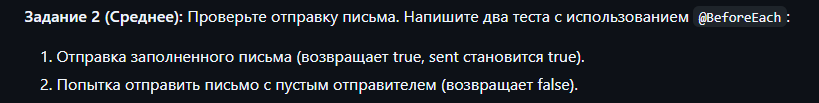
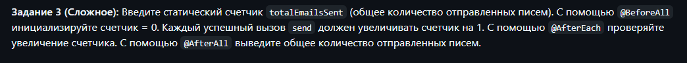
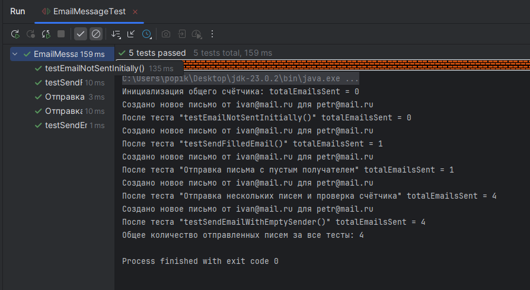
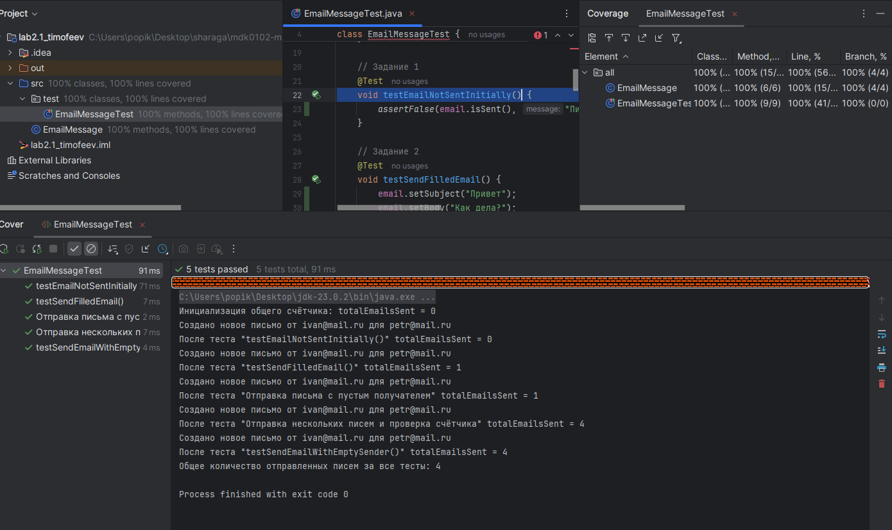

# Лабораторная работа №2_1: Тестовое окружение в JUnit

## 👨🎓 Студент
- **ФИО:** Тимофеев Артём Федорович
- **Группа:** 245
- **Вариант:** 25 (Электронное письмо)

---

## ✅ Выполненные задания

### Задание 1 (Простое)
**Тест:** Проверка, что письмо не отправленно после создания

### Задание 2 (Среднее)
**Тесты:** 
- Отправка заполненного письма → true, sent = true
- Отправка письма с пустым отправителем → false, sent = false

### Задание 3 (Сложное)
**Тест:** 
- Отправка нескольких писем и проверка счетчика
- Отправка письма с пустым получателем

---

## 📊 Результаты

---

## 📎 Ссылки
- [Код тестов](lab2.1_timofeev/src/test/EmailMassageTest.java)
- [Основной класс](lab2.1_timofeev/src/EmailMassage.java)

*Дата: 11.03.2026*
